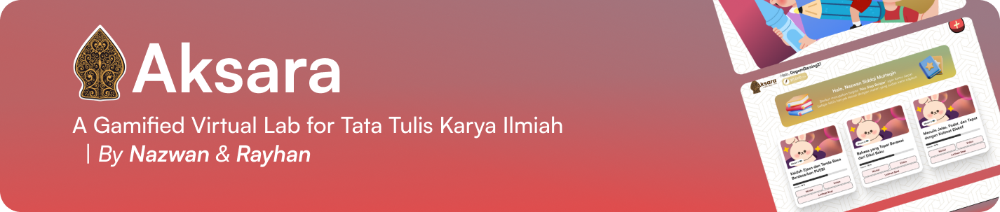

<<<<<<< HEAD

   
    
   

   
  

    
    
    
    
  

  <h3 align="center">Integrals & Derivatives - A Gamified Virtual Lab</h3>

   

     Check the project on this fully responsive <a href="aksara-virtual-lab.vercel.app" target="_blank"><b>Website</b></a>. Feel free to leave a suggestion!
    

## Table of Contents
1. [🪶 Pendahuluan](#-pendahuluan)
2. [🧩 Fitur Utama](#-fitur-utama)

---

## 🪶 Pendahuluan

**Aksara** adalah platform *Virtual Lab* interaktif yang dirancang untuk membantu pelajar menguasai keterampilan **Tata Tulis Karya Ilmiah (TTKI)** berbasis kaidah **KBBI** dan **PUEBI**.  

Melalui konsep **belajar ➜ praktik ➜ refleksi ➜ gamifikasi**, pengguna tidak hanya memahami teori, tetapi juga *terlibat aktif* dalam simulasi dan permainan bahasa yang menyenangkan.

Filosofi nama *“Aksara”* berarti **cahaya, aksara, atau huruf pencerah**, yang menggambarkan misi platform ini untuk mencerahkan kemampuan literasi ilmiah pengguna.

---

## 🧩 Fitur Utama

### 1. Belajar  
Pengguna dapat mempelajari materi sesuai dengan modul yang telah disiapkan.  
Tersedia **3 modul utama**, yaitu:
- **Kaidah Ejaan dan Tanda Baca (PUEBI)**  
- **Bahasa yang Tepat Berawal dari Diksi Baku (KBBI)**  
- **Menulis Jelas, Padat, dan Tepat dengan Kalimat Efektif**  

Selain materi ajar berbasis teks interaktif, pengguna juga dapat menonton **video pembelajaran** untuk memperdalam pemahaman.

---

### 2. Latihan  
Setiap modul dilengkapi dengan **latihan soal** berbasis tiga tingkatan kesulitan:
- Mudah  
- Sedang  
- Sulit  

Soal mencakup **pilihan ganda, esai, dan drag & drop**.  
Pengguna memperoleh **Tinta** dari setiap latihan, yang digunakan untuk membuka level berikutnya dan karakter baru dalam sistem gamifikasi Aksara.

---

### 3. Main  
Fitur bermain dirancang agar pengguna dapat *belajar sambil bermain*.  
Terdapat dua permainan utama:  
- **Teka-Teki Silang (TTS):** menguji pemahaman istilah dan konsep kebahasaan.  
- **Drag and Drop:** menyusun kalimat atau memilih kata baku secara interaktif.  

Kedua permainan diadaptasi dari materi pada setiap modul, dan hanya bisa diakses setelah pengguna mencapai level tertentu.  

---

> 🌟 *Aksara mengubah proses belajar kebahasaan menjadi pengalaman yang hidup, menyenangkan, dan bermakna.*  
> “Dari aksara, lahir cahaya pengetahuan.” ✨
